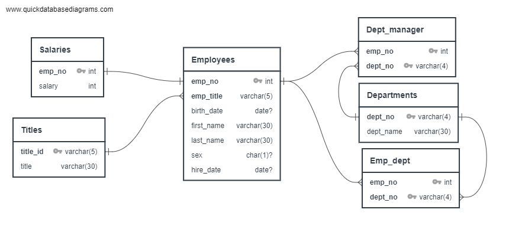
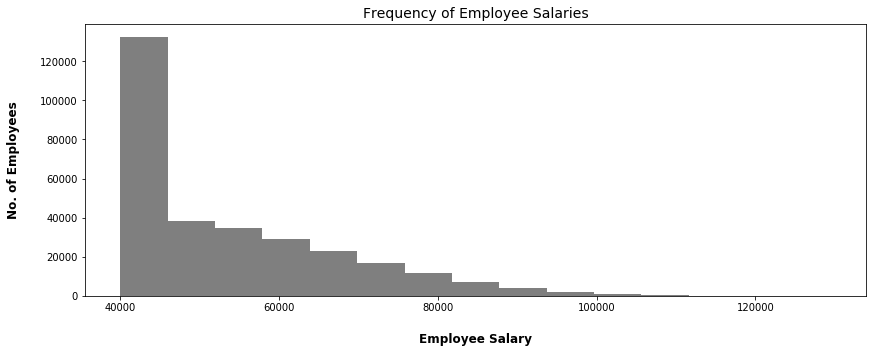

# Employee Database Analysis

## Background

I designed tables to hold data in the six employees CSVs, imported the CSVs into a SQL database, and answered questions about the data. 

#### Data Modeling

* Developed a an entity-relationship model

#### Data Engineering

* Used the information to create a [schema](EmployeeSQL/schema.sql) for each of the six CSV files. 

* Imported each CSV file into the corresponding SQL table. 

#### Data Analysis

Conducted a number of [queries](EmployeeSQL/queries.sql) to explore data. 

### Analysis

see [code](EmployeeSQL/Salary Analysis.ipynb)

1. Imported the SQL database into Pandas. 

2. Analyszed trends in employee salaries

